# Hola, DENVER! 👋

> Pronounce it [denve:r], not [denvər]. It’s an español word 😂  
> [My profile on Notion](https://fe-dev-denver.notion.site/Hola-DENVER-e58b3ac4e5e9464ea7ef537957a2e4ad)

## About the "Top Lang(Most used languages)"

- Hidden languages: Jupyter Notebook, HTML, and CSS

### Why are those hidden?

- Jupyter Notebook: Showen by top lang. But it is not my primary lang
- HTML and CSS: Not programming or a scripting language
